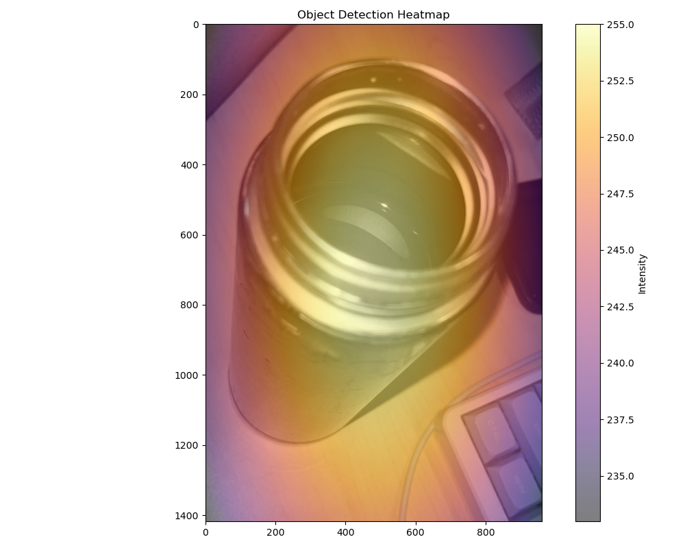

---

## 1. 导入模块

```python
import matplotlib.pyplot as plt
import numpy as np
from PIL import Image, ImageDraw # 用于图像处理和在占位符上绘制文本
import matplotlib.colors
import cv2 # OpenCV 用于高斯模糊

# 尝试导入YOLO模型库
try:
    from ultralytics import YOLO
    YOLO_AVAILABLE = True
except ImportError:
    print("警告：未找到 'ultralytics' 库。YOLO 模型功能将不可用，将回退到模拟热力图。")
    print("请使用 'pip install ultralytics opencv-python' 安装所需库。")
    YOLO_AVAILABLE = False
```

**笔记：**
- `try/except` 是 Python 的异常处理机制，尝试导入 `ultralytics` 库
- 如果导入失败（库没安装），设置 `YOLO_AVAILABLE = False`，后续会使用模拟热力图作为回退方案
- **回退（Fallback）**：当原本想用的方法失败了，自动切换到备用方案

---

## 2. 辅助函数：生成模拟热力图

```python
# --- 辅助函数：生成模拟热力图 (用作占位符或回退) ---
def generate_simulated_heatmap(image_width, image_height, object_center_x, object_center_y, object_width, object_height, max_intensity=255, falloff_rate=0.0005):
    """
    为对象生成模拟热力图。
    热度在对象中心最高，向外递减。
    此函数作为实际模型输出的占位符或回退使用。
    """
    y, x = np.ogrid[:image_height, :image_width]
    # np.ogrid 生成广播用的坐标网格
    # x 是 (image_height, 1) 的列向量
    # y 是 (1, image_width) 的行向量
    # 两者相加时会自动广播，生成完整网格

    std_x = object_width / 2
    std_y = object_height / 2
    std_x = max(std_x, 1) # 避免除以零
    std_y = max(std_y, 1) # 避免除以零
    # 标准差控制热力图的"胖瘦"：标准差越大，热力图越分散

    dist_sq = (((x - object_center_x)**2) / (2 * std_x**2)) + \
              (((y - object_center_y)**2) / (2 * std_y**2))
    # 计算每个像素到中心的归一化距离平方
    # 这是二维高斯分布的指数部分
    # 公式来源：二维高斯 r² = (x-x₀)²/2σx² + (y-y₀)²/2σy²

    heatmap = max_intensity * np.exp(-dist_sq * falloff_rate * 10)
    # 高斯衰减：中心热度最高，向外指数递减
    # exp(0) = 1（最热），exp(-10) ≈ 0.00005（基本为零）

    return np.clip(heatmap, 0, max_intensity)
    # np.clip 确保热度值在 [0, max_intensity] 范围内
    # 防止出现负数或超过255的值
```

**笔记：**

### `np.ogrid` 广播机制

```python
# 假设图像 5x4
x = [[0],[1],[2],[3],[4]]  # 列向量 (5,1)
y = [[0,1,2,3]]           # 行向量 (1,4)

# 广播后效果：
#       y → [0, 1, 2, 3]
# x ↓ ┌───────────────
#  0  │ 0, 1, 2, 3
#  1  │ 1, 2, 3, 4
#  2  │ 2, 3, 4, 5
#  3  │ 3, 4, 5, 6
#  4  │ 4, 5, 6, 7
```

---

## 3. 主函数：从真实模型获取热力图

```python
# --- 函数：从真实模型获取热力图 ---
def get_heatmap_from_actual_model(image_np, model_type='detection', object_class_name='cup'):
    """
    尝试从真实模型获取热力图。
    如果可用，使用 YOLOv10x 进行目标检测和热力图生成。
    否则，回退到模拟热力图。

    参数:
        image_np (numpy.ndarray): 输入图像的 NumPy 数组 (H, W, C)。
        model_type (str): 当前仅支持 'detection'。
        object_class_name (str): 检测目标类别名称（例如 'cup'）。

    返回:
        numpy.ndarray: 生成的热力图（二维数组）。
    """
    print(f"正在尝试使用 '{model_type}' 模型方法生成热力图。")
    image_height, image_width = image_np.shape[:2]

    if model_type == 'detection' and YOLO_AVAILABLE:
        # 条件1：model_type 必须是 'detection'
        # 条件2：YOLO 库必须可用（已安装）
        try:
            model_name = 'yolov10x.pt' # 尝试YOLOv10x, 这是YOLOv10系列中较大的模型
            # model_name = 'yolov9c.pt' # 可以改回YOLOv9c或其他模型进行测试
            # model_name = 'yolov8s.pt'
            print(f"  步骤：加载预训练的 {model_name} 模型。")
            model = YOLO(model_name)
            # 加载预训练模型权重（约50MB+）
            # 预训练 = 已经在 COCO 数据集上训练好，能识别80种物体

            print("  步骤：预处理图像并进行推理。")
            # 可以调整推理参数，例如置信度阈值 conf
            results = model(image_np, verbose=False, conf=0.25)
            # verbose=False：关闭详细日志
            # conf=0.25：只保留置信度≥25%的检测结果
            # results = [Result] 对象，包含检测框、类别、置信度等

            heatmap = np.zeros((image_height, image_width), dtype=np.float32)
            # 创建与原图同尺寸的全零数组
            # dtype=float32 因为后续要存置信度（0~1的小数）
            detections_found = 0
            # 计数器，记录找到了多少个目标

            print(f"  步骤：过滤 '{object_class_name}' 类别的检测结果。")
            target_cls_id = -1
            # -1 表示"未找到"的哨兵值

            if hasattr(model, 'names') and isinstance(model.names, dict):
                # hasattr：检查对象是否有该属性
                # isinstance：检查类型是否是字典
                # 双重保险，防止模型结构不符合预期时崩溃

                for cls_id, name_val in model.names.items():
                    # 遍历模型的类别名称字典
                    # model.names = {0: 'person', 41: 'cup', ...}
                    if name_val == object_class_name:
                        # 找到目标类别（如 'cup'）
                        target_cls_id = cls_id  # 记录类别ID（如41）
                        break  # 找到了就退出循环，提高效率


            if target_cls_id == -1:
                print(f"  警告：在模型类别中未找到 '{object_class_name}' 或无法访问 model.names。将显示空热力图。")
            else:
                print(f"  '{object_class_name}' 的类别 ID：{target_cls_id}")

                for result in results:
                    # 遍历每张图的检测结果（通常只有一张图）
                    for box in result.boxes:
                        # 遍历每个检测框
                        cls = int(box.cls)    # 类别ID（numpy.int64 → int）
                        conf = float(box.conf)  # 置信度（0~1）
                        if cls == target_cls_id:
                            # 如果是目标类别
                            detections_found += 1
                            # 提取边界框坐标 [x1, y1, x2, y2]
                            x1, y1, x2, y2 = map(int, box.xyxy[0])
                            # 使用置信度作为热度值填充矩形
                            cv2.rectangle(heatmap, (x1, y1), (x2, y2), conf, thickness=cv2.FILLED)
                            # cv2.FILLED 表示填充整个矩形（不是画边框）
                            # conf 作为填充的热度值

                if detections_found > 0:
                    # 找到了至少一个目标
                    print(f"  找到 {detections_found} 个 '{object_class_name}' 检测结果。")
                    # 调整高斯模糊的核大小，可以根据效果调整
                    # 较大的核会产生更模糊（弥散）的热力图
                    blur_kernel_size = (101, 101) # 可以尝试减小如 (51,51) 或增大
                    # 核越大，模糊范围越大、效果越柔和
                    heatmap = cv2.GaussianBlur(heatmap, blur_kernel_size, 0)
                    # 高斯模糊让硬边缘变得平滑自然

                    if heatmap.max() > 0:
                        heatmap = (heatmap / heatmap.max()) * 255 # 归一化到0-255
                        # 模糊后最大值可能不是255，归一化后映射到0-255

                    print("  步骤：基于检测结果生成热力图。")
                    return heatmap.astype(np.uint8)
                    # astype(np.uint8)：转为图像标准类型（0-255整数）
                else:
                    print(f"  在当前设置下未找到 '{object_class_name}' 检测结果。将显示空热力图。")
                    return heatmap # 返回空热力图

        except Exception as e:
            # 捕获任何异常（模型崩溃、内存不足等）
            print(f"  YOLO 模型操作期间出错：{e}")
            print("  回退：使用模拟热力图。")
            # 继续执行模拟热力图生成

    # ----- 如果模型不可用或发生错误，回退到模拟热力图 -----
    print("  回退：使用模拟热力图作为占位符。")
    center_x_ratio = 0.47   # 中心X = 图像宽度的47%
    center_y_ratio = 0.45   # 中心Y = 图像高度的45%
    width_ratio = 0.20      # 宽度 = 图像宽度的20%
    height_ratio = 0.30     # 高度 = 图像高度的30%
    # 用固定比例模拟一个"典型"杯子在图像中的位置和大小

    obj_center_x_abs = int(center_x_ratio * image_width)
    obj_center_y_abs = int(center_y_ratio * image_height)
    obj_width_abs = int(width_ratio * image_width)
    obj_height_abs = int(height_ratio * image_height)
    # 将比例转换为实际像素值

    simulated_heatmap = generate_simulated_heatmap(
        image_width, image_height,
        obj_center_x_abs, obj_center_y_abs,
        obj_width_abs, obj_height_abs
    )
    return simulated_heatmap
```

**笔记：**


### 检测框坐标格式 `xyxy`

```
   (x1,y1)───────────
    │                │
    │   检测框        │
    │                │
    ───────────(x2,y2)

    x1,y1 = 左上角坐标
    x2,y2 = 右下角坐标
```


---

## 4. 绘图函数：叠加显示热力图

```python
def plot_image_with_heatmap(image_path, heatmap_data, title="目标检测热力图", alpha=0.6, cmap_name='inferno'):
    """
    在图像上叠加热力图并显示它。所有绘图文本均为中文。
    """
    try:
        img = Image.open(image_path).convert('RGB')
        # Image.open：打开图像文件
        # convert('RGB')：统一转换为3通道RGB格式（避免PNG的4通道RGBA问题）
    except FileNotFoundError:
        # 文件不存在时的处理：创建占位图
        print(f"错误：未找到图像文件 {image_path}。")
        img = Image.new('RGB', (500, 500), color = (128, 128, 128))
        # Image.new：创建指定尺寸和颜色的新图像
        draw = ImageDraw.Draw(img)
        draw.text((50, 230), "图像未找到。\n请使用有效的路径。", fill=(255,0,0))
        # 在占位图上绘制错误提示文字
        heatmap_data = np.zeros((500, 500))
        # 同时创建空热力图
        print("显示占位图像和空热力图。")

    img_np = np.array(img)
    # PIL Image → NumPy 数组

    fig, ax = plt.subplots(1, 1, figsize=(10, 8))
    # fig = 整个图形对象
    # ax = 坐标轴对象
    # figsize=(10, 8) = 图形尺寸（英寸）
    ax.imshow(img_np)
    # 先显示原图作为底层

    if heatmap_data.max() > 0:
        # 热力图不是空的才叠加
        if heatmap_data.shape[0] != img_np.shape[0] or heatmap_data.shape[1] != img_np.shape[1]:
            # 热力图和原图尺寸不一致，需要调整
            print(f"警告：热力图尺寸 ({heatmap_data.shape}) 与图像尺寸 ({img_np.shape[:2]}) 不一致。正在调整热力图大小。")
            heatmap_pil = Image.fromarray(heatmap_data.astype(np.uint8))
            # NumPy数组 → PIL Image
            heatmap_resized_pil = heatmap_pil.resize((img_np.shape[1], img_np.shape[0]), Image.BICUBIC)
            # Image.BICUBIC：双三次插值，质量好但较慢
            # (宽, 高) = (img_np.shape[1], img_np.shape[0])
            heatmap_data_resized = np.array(heatmap_resized_pil)
            # PIL Image → NumPy 数组
            cax = ax.imshow(heatmap_data_resized, cmap=plt.get_cmap(cmap_name), alpha=alpha, extent=(0, img_np.shape[1], img_np.shape[0], 0))
            # cmap='inferno'：热力图配色（黑→紫→红→橙→黄→白）
            # alpha=0.6：60%透明度
            # extent：控制图像在坐标轴上的范围
        else:
            cax = ax.imshow(heatmap_data, cmap=plt.get_cmap(cmap_name), alpha=alpha, extent=(0, img_np.shape[1], img_np.shape[0], 0))

        cbar = fig.colorbar(cax, ax=ax, orientation='vertical', fraction=0.046, pad=0.04)
        cbar.set_label('热力图强度（模型生成或模拟）', rotation=270, labelpad=15)
        # 添加颜色条，显示热度值和颜色的对应关系
    else:
        print("热力图为空（无检测结果或模型未运行），不进行叠加。")

    ax.set_title(title, fontsize=16)
    ax.set_xlabel("X 坐标（像素）", fontsize=12)
    ax.set_ylabel("Y 坐标（像素）", fontsize=12)
    ax.axis('on')
    plt.tight_layout()
    # 自动调整子图参数，避免重叠
    plt.show()
    # 显示图形窗口
```


## 5. 主程序入口

```python
if __name__ == '__main__':
    # --- 配置 ---
    image_file_path = 'cup.png' # 默认使用提到识别有困难的俯视图图像
    # image_file_path = 'image_2d8ceb.png' # 之前可以识别的图像
    # image_file_path = 'image_2d208d.jpg' # 另一张测试图像

    target_object_name = 'cup'
    # 要检测的目标类别名称

    # --- 加载图像 ---
    try:
        img_for_model = Image.open(image_file_path).convert('RGB')
        img_np_for_model = np.array(img_for_model)
        img_height, img_width = img_np_for_model.shape[:2]
        print(f"正在为图像生成热力图：{image_file_path}（尺寸：{img_width}x{img_height}）")
    except FileNotFoundError:
        print(f"严重错误：未找到图像文件 '{image_file_path}'。无法继续。")
        img_np_for_model = np.zeros((500, 500, 3), dtype=np.uint8)
        img_width, img_height = 500, 500


    # --- 生成热力图 ---
    heatmap_output = get_heatmap_from_actual_model(
        img_np_for_model,
        model_type='detection',
        object_class_name=target_object_name
    )
    # 调用主函数获取热力图（YOLO或模拟）

    # --- 绘制带热力图的图像 ---
    plot_title = f"'{target_object_name}' 的热力图（YOLOv10x 或模拟）"
    plot_image_with_heatmap(
        image_path=image_file_path,
        heatmap_data=heatmap_output,
        title=plot_title,
        alpha=0.5,
        cmap_name='inferno'
    )
    # alpha=0.5 比函数默认值0.6更低，热力图更透明

    if not YOLO_AVAILABLE:
        # 如果 YOLO 库未安装，给出提示
        print("\n提示：要使用真实的 YOLO 模型生成热力图，请确保已安装 'ultralytics' 和 'opencv-python'。")
        print("可以通过 'pip install ultralytics opencv-python' 安装。")
        print("当前显示的是模拟热力图。")
```

**笔记：**

### `if __name__ == '__main__':` 的含义

```python
# 作用：控制代码块只在直接运行脚本时执行，被 import 时不执行

# 方式1：直接运行
$ python attention heatmap.py
→ __name__ == '__main__' → 执行 main 块

# 方式2：作为模块导入
$ python -c "import attention_heatmap"
→ __name__ == 'attention_heatmap' → 不执行 main 块
```


---

## 附录：数据类型说明

### uint8 类型

```python
uint8  # unsigned integer 8-bit
# 范围：0 ~ 255（正好是8个二进制位能表示的范围）
# 为什么图像用它？因为颜色就是0-255

# float32 vs uint8
float32(198.7)  # 用于神经网络计算，内存大，值精确
uint8(199)      # 用于图像显示，内存小，范围固定
```

### 图像通道

```python
# 灰度图：1通道
img.shape → (高度, 宽度)

# 彩色图 RGB：3通道
img.shape → (高度, 宽度, 3)
# 每个像素 = (R, G, B)，各0-255

# RGBA图：4通道（PNG支持透明）
img.shape → (高度, 宽度, 4)
# 每个像素 = (R, G, B, A)，A是透明度
```

---
### 复现结果：



